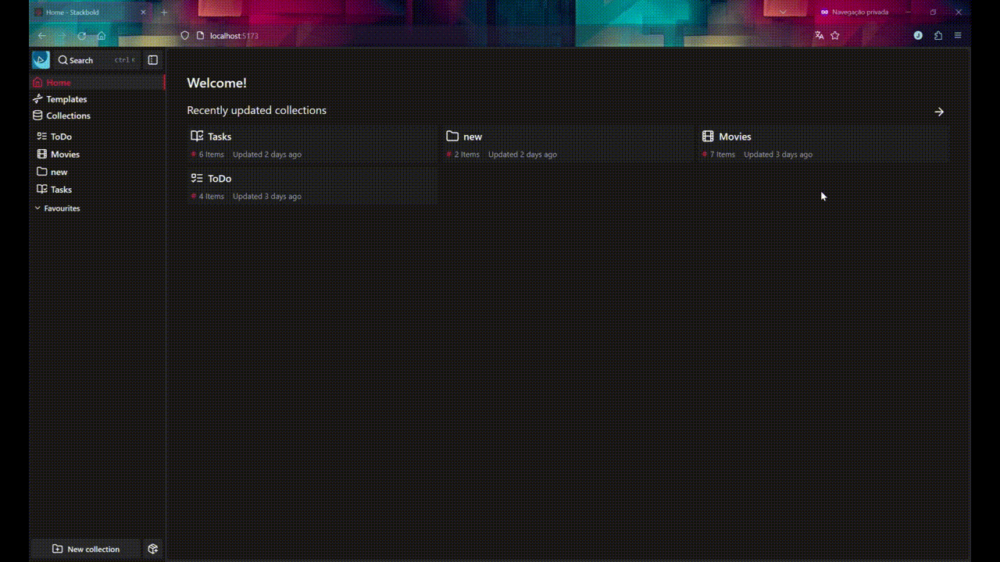
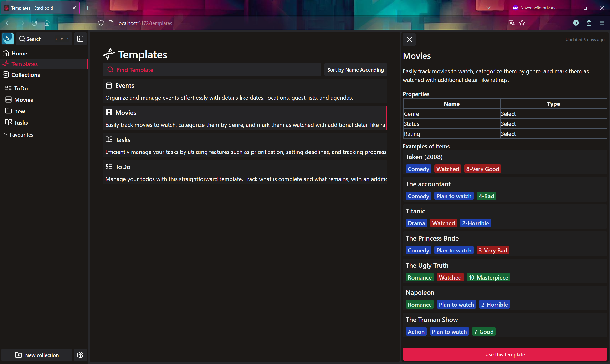
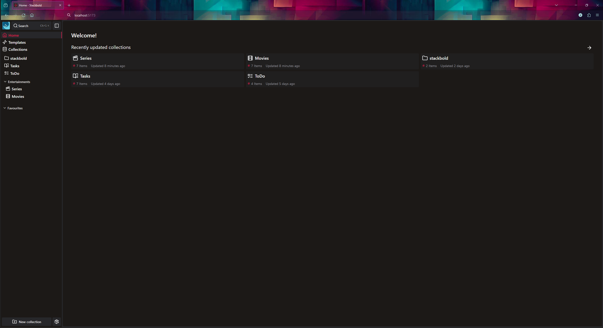

<p align="center">
 
 <h1 align="center">
  Stackbold
 </h1>
</p>

StackBold is a versatile web application designed to simplify organization by serving as a centralized hub for all collections. Whether users need simple to-do lists or personalized collections like projects manager, movie, or series lists, StackBold offers intuitive features to organize and manage them efficiently. Users have the flexibility to create customized categories; for instance, within movie collections, users can establish categories like "watched," "watching," and "plan to watch," allowing for tailored collections that align with their individual preferences and needs.

> [Stackbold](https://github.com/M1NMAX/stackbold) is the latest implementation of [Guardian](https://github.com/M1NMAX/gardian) reimagined and implemented using [Svelte](https://svelte.dev).



## Technologies:

- Supabase: Used for user management and authentication functionalities.
- MongoDB: Utilized for storing application data, including user-generated content.
- Prisma: Used for defining the database schema and interacting with the database.
- TRPC: Used for Back-end API development, ensuring End-to-end typesafe.
- Svelte and Shadcn-svelte: Utilized to create the UI and deliver enhanced UX.

## Installation and Exectuion

```bash
# clone the repo
git clone https://github.com/M1NMAX/stackbold

# Navigate to clonned folder and Install dependencies
cd stackbold && npm install
```

Set up the environment variables described in `.env.example`

```
# Generate prisma client and seed the data base
npx prisma generate && npx prisma db seed

# run the app
npm run dev
```

## Extra pictures



